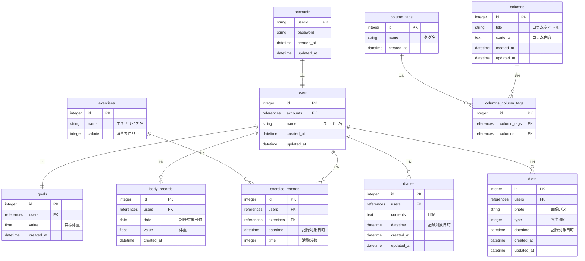

```mermaid　
erDiagram
  exercises ||--o{ exercise_records : "1:N"
  accounts ||--|| users : "1:1"
  users ||--|| goals : "1:1"
  users ||--o{ body_records : "1:N"
  users ||--o{ exercise_records: "1:N"
  users ||--o{ diaries: "1:N"
  users ||--o{ diets: "1:N"
  column_tags ||--o{ columns_column_tags : "1:N"
  columns ||--o{ columns_column_tags : "1:N"

  accounts {
    string userId PK
    string password
    datetime created_at
    datetime updated_at
  }

  users {
    integer id PK
    references accounts FK
    string name "ユーザー名"
    datetime created_at
    datetime updated_at
    
  }

  body_records {
    integer id PK
    references users FK
    date date "記録対象日付"
    float value "体重"
    datetime created_at
    
  }

  goals {
    integer id PK
    references users FK
    float value "目標体重"
    datetime created_at
    
  }

  exercises {
    integer id PK
    string name "エクササイズ名"
    integer calorie "消費カロリー"
  }

  exercise_records {
    integer id PK
    references users FK
    references exercises FK
    datetime datetime "記録対象日時"
    integer time "活動分数"
  }

  diaries {
    integer id PK
    references users FK
    text contents "日記"
    datetime datetime "記録対象日時"
    datetime created_at
    datetime updated_at
    
  }

  column_tags {
    integer id PK
    string name "タグ名"
    datetime created_at
    
  }

  columns {
    integer id PK
    string title "コラムタイトル"
    text  contents "コラム内容"
    datetime created_at
    datetime updated_at
    
  }

  columns_column_tags {
    integer id PK
    references column_tags FK
    references columns FK
  }

  diets {
    integer id PK
    references users FK
    string photo "画像パス"
    integer type "食事種別"
    datetime datetime "記録対象日時"
    datetime created_at
    datetime updated_at
    
  }
```